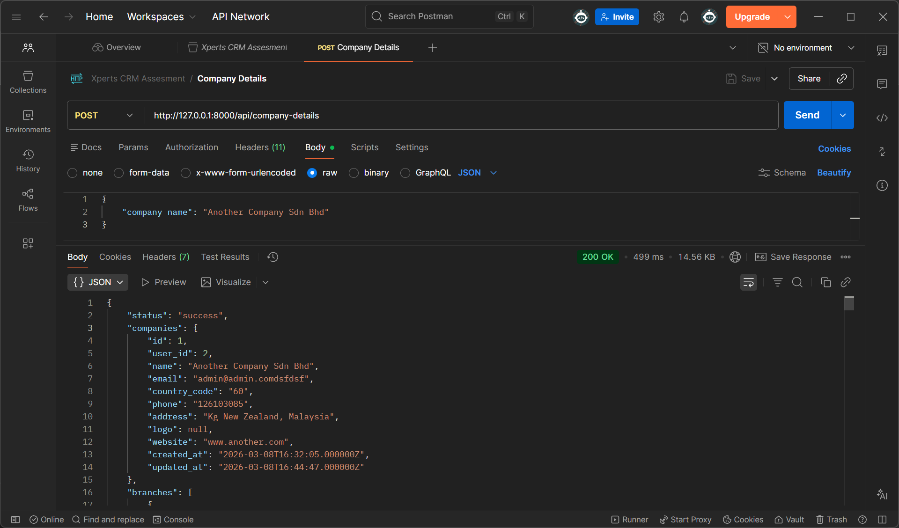
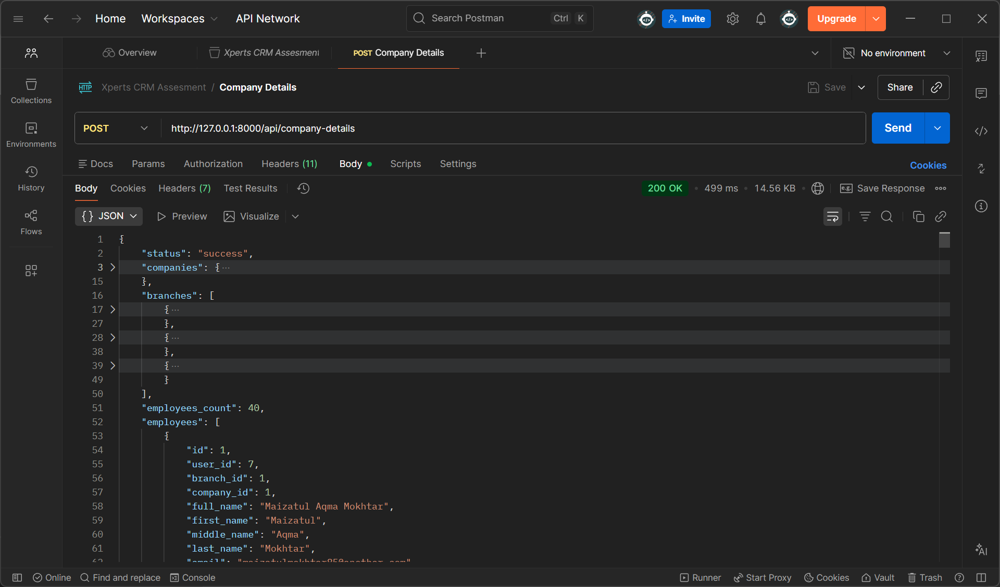
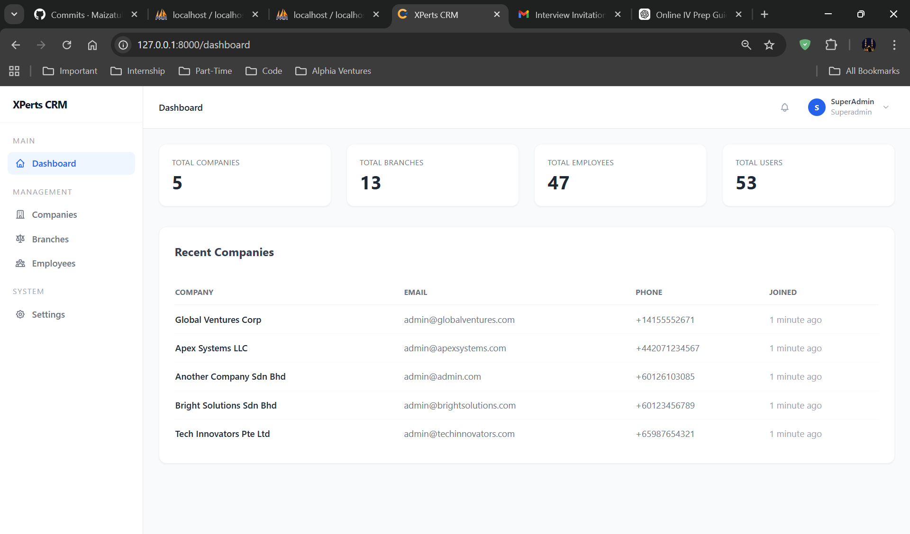
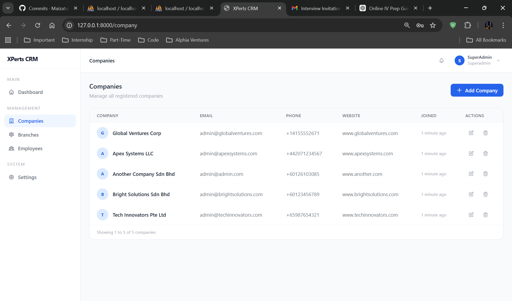
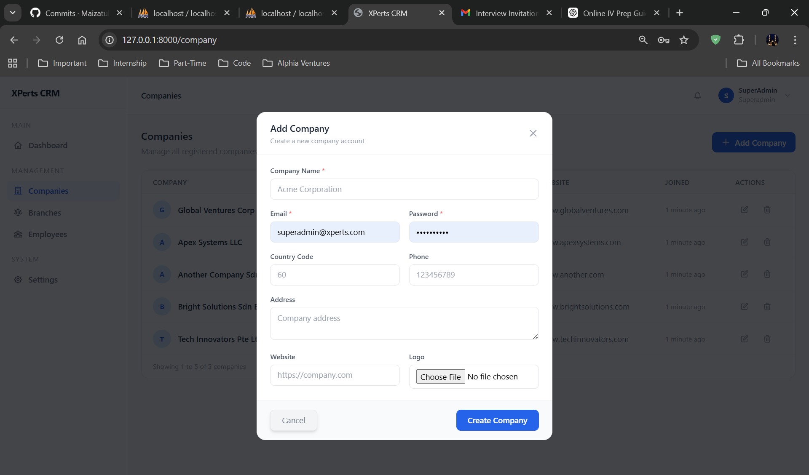
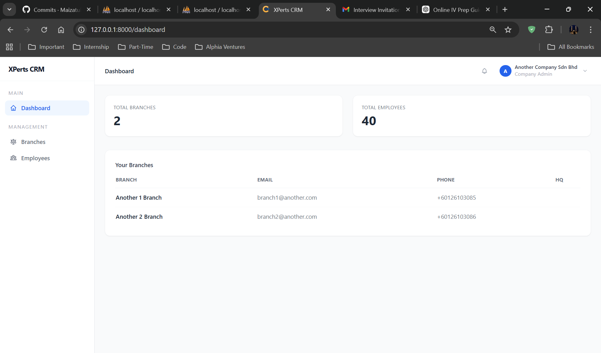
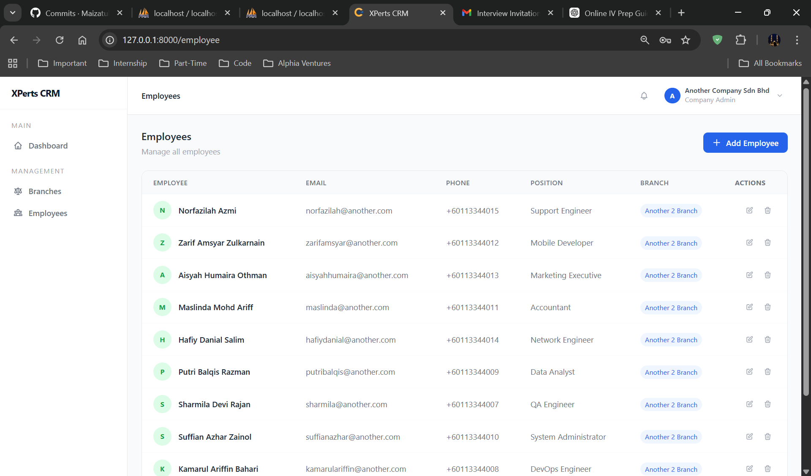
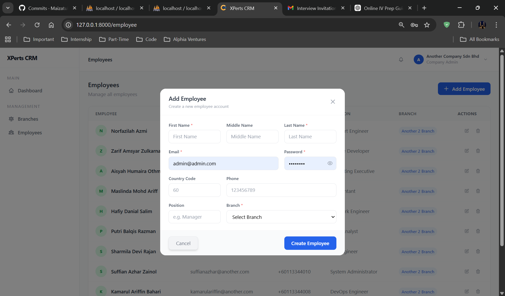
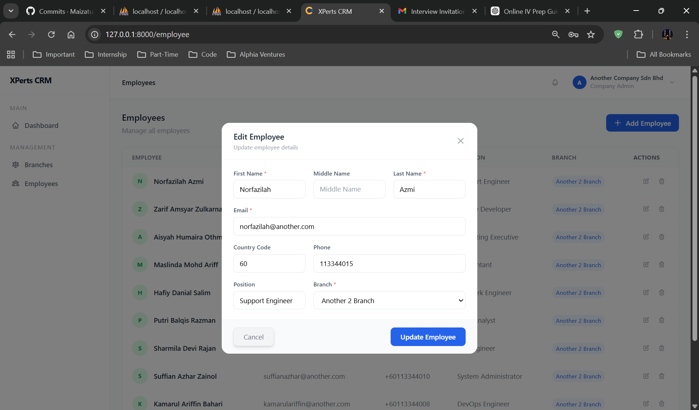

Project Overview

This project is a Mini CRM Admin Panel built using Laravel.
The system allows administrators to manage companies and their employees through a simple admin interface.

Administrators can perform full CRUD operations on companies and employees, upload company logos, and view paginated data. The project also includes an API endpoint that returns company data along with its employees.

The application demonstrates the use of Laravel features such as authentication, migrations, Eloquent relationships, resource controllers, validation, API routes, and pagination.

Features
    - Authentication
    - Company Management
    - Branch Management
    - Employee Management
    - API Endpoint

Credentials of Xperts CRM assessment
    Role: SuperAdmin
        - email: superadmin@xperts.com
        - password: XPerts1234
    
    Role: Company
        - email: admin@admin.com
        - password: password
    
    Role: Employee
        - email: maizatulmokhtar85@another.com
        - password: password

## Screenshots

### 1. API Response  
  - 

- 

### 2. System Interface

- Super Admin Dashboard Overview
  

- Super Admin Company Management
  

- Add Company
  

- Company Dashboard Overview
  

- Employee Management
  

- Add Employee
  

- Edit Employee
  
